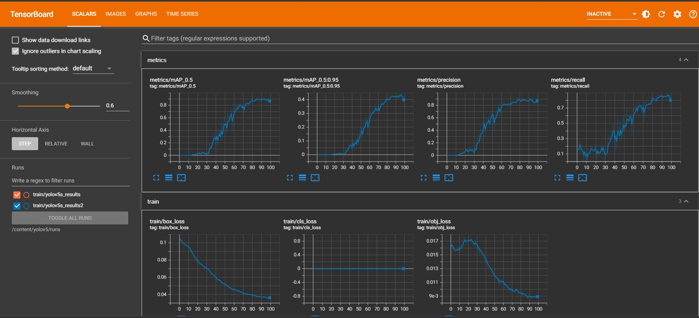

# YOLO 버전 

YOLOv4는 v5에 비해 느리게 동작하지만 FPS성능 최적화 가능
YOLOv5는 v4에 비해 쉽게 환경을 구성 및 구현 가능 

v4 (darknet 기반)
v5 (pytorch 기반)

연구 및 엔지니어를 위한 용도로는 v4가 효율적일 것 같지만
실용적인 측면에서 빠르게 구현을 하고자 한다면 v5가 좋을 것이라 판단

# 데이터 셋
1. [데이터1](https://aistudio.baidu.com/aistudio/datasetdetail/107770?lang=en) aistudio에서 다운 가능 

2. [데이터2](https://public.roboflow.com/object-detection/wildfire-smoke) roboflow에서 다운 가능

3. [데이터3](https://www.kaggle.com/ankan1998/coco-csv-format-fire-object-detection?select=README.roboflow.txt) kaggle에서 다운 가능


# roboflow 
## wildfire 데이터


개발환경 - colab
1. 다운 코드(roboflow에서 제공)를 받아 colab에서 실행 시킨다.

```  
  받은 파일의 label은  
  0 0.29921875 0.44166666666666665 0.0578125 0.0375  
  class x y weight height 을 나타낸다.
```

2. colab의 content폴더(메인)로 이동한 후 yolov5를 clone해준다.
3. 필요한 패키지들을 requirements.txt에서 다운

4. `%cat /content/data.yaml ` 를 통해 데이터를 살펴보면
training과 validation경로가 나온다.
```
train: ../train/images
val: ../valid/images

nc: 1 // 클래스 개수
names: ['smoke'] // 클래스 이름
```

5. 데이터 셋 준비는 끝났다. 이후 모델을 선택해줘야 하는데, 

  이렇게 모델이 준비되어 있고 이번 프로젝트에서는 YOLOv5s를 사용할 예정이다.
우선 테스트 용으로 가볍게 적용해 볼 예정이기 때문이다.
```
train : valid : test = 516 : 147 : 74
```

6.  모델의 파라미터를 변경한 후 학습을 시키면 되는데
epochs는 1000으로 그리고 batch_size는 32로 하는 것이 최적의 상태일 것으로 예상된다.....
시간상 일단 500에 16으로 해봄.
```

!python train.py --img 416 --batch 16 --epochs 100 --data\\ '../data.yaml' --cfg ./models/custom_yolov5s.yaml --weights ''\\ 
--name yolov5s_results  --cache
```

7. 학습 결과를 확인
```
%load_ext tensorboard
%tensorboard --logdir /content/yolov5/runs
```



# 적용
```
// best.pt -> smokeDetection파일로 만들어진 가중치

// video.mp4에서 smoke detect
python detect.py --weights <best.pt> --source <video.mp4>

// webcam
python detect.py --weights <best.pt> --source 0 

```